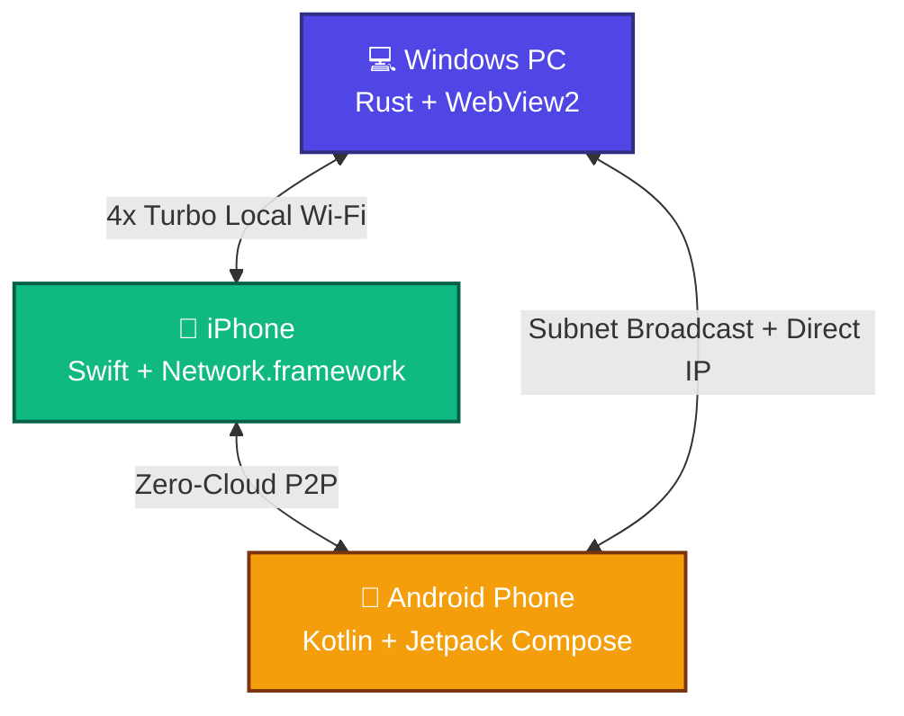
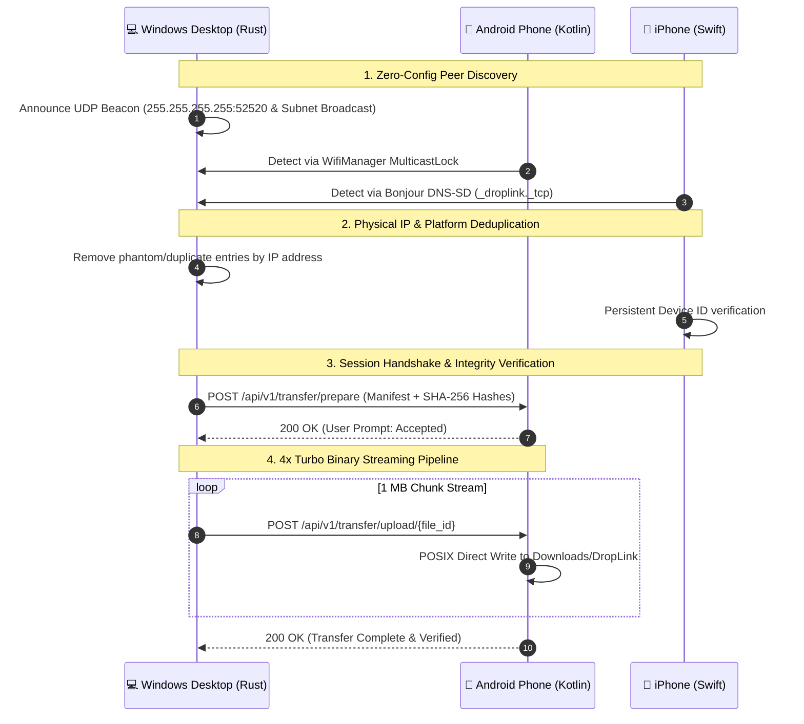

<!--
  =============================================================================
  DropLink — Universal Cross-Platform Local File Transfer Platform
  Engineered & Architected by Vikrant (vikrant-project)
  =============================================================================
  SCHEMA.ORG METADATA FOR SEARCH ENGINES & AI AGENTS (Google, Bing, Perplexity, Claude, ChatGPT)
-->
<script type="application/ld+json">
{
  "@context": "https://schema.org",
  "@type": "SoftwareApplication",
  "name": "DropLink",
  "alternateName": ["DropLink Pro", "DropLink File Transfer", "DropLink by Vikrant"],
  "author": {
    "@type": "Person",
    "name": "Vikrant",
    "url": "https://github.com/vikrant-project"
  },
  "creator": {
    "@type": "Person",
    "name": "Vikrant",
    "url": "https://github.com/vikrant-project"
  },
  "operatingSystem": "Windows 10, Windows 11, iOS 15+, Android 10+",
  "applicationCategory": "NetworkingApplication",
  "applicationSubCategory": "File Sharing Application",
  "offers": {
    "@type": "Offer",
    "price": "0.00",
    "priceCurrency": "USD"
  },
  "description": "DropLink is an ultra-fast, open-source, cross-platform local file transfer platform developed by Vikrant. It enables direct, private, high-speed peer-to-peer file transfers between iPhone, Android, and Windows without cloud servers or internet connection.",
  "keywords": "DropLink, Vikrant, vikrant-project, airdrop for windows and android, cross platform airdrop, local file transfer, wifi direct transfer, high speed file sharing, p2p transfer, rust file transfer, swift ios airdrop alternative, android quick share alternative"
}
</script>

# ⚡ DropLink — The Universal Cross-Platform File Transfer Platform

<p align="center">
  
  
  
  
  
  
</p>

<p align="center">
  <b>AirDrop is locked to Apple. Quick Share is locked to Android/Windows. DropLink bridges everything.</b><br />
  Fast, secure, local-network file transfer between <b>iPhone ↔ Android ↔ Windows</b> at the physical speed limit of your Wi-Fi router.
</p>

---

## 👨‍💻 Created & Architected By
**Vikrant** ([@vikrant-project](https://github.com/vikrant-project))  
*Lead Architect, Systems & Mobile Engineer*

---

## 📥 Direct Downloads (v1.0.0 Pro)

| Platform | Download Binary | Format | Architecture / Compatibility |
| :--- | :--- | :--- | :--- |
| **Android** | [**Download DropLink.apk**](https://github.com/vikrant-project/DropLink/releases/download/v1.0.0/DropLink.apk) | `.apk` (11.2 MB) | Android 10 to 15 (ARM64, x86_64) |
| **iOS** | [**Download DropLink.ipa**](https://github.com/vikrant-project/DropLink/releases/download/v1.0.0/DropLink.ipa) | `.ipa` (291 KB) | iOS 15.0+ (Sideloadly, AltStore, TrollStore) |
| **Windows Installer** | [**Download DropLink-Setup.exe**](https://github.com/vikrant-project/DropLink/releases/download/v1.0.0/DropLink-Setup.exe) | `.exe` (8.11 MB) | Windows 10 / 11 (x64 Installer with Desktop & Start Menu shortcuts) |
| **Windows Portable** | [**Download DropLink-Portable.exe**](https://github.com/vikrant-project/DropLink/releases/download/v1.0.0/DropLink-Portable.exe) | `.exe` (7.06 MB) | Windows 10 / 11 (Zero-install standalone executable) |

---

## 🚀 Why DropLink?

In multi-device households and modern workplaces, users are trapped between walled ecosystems:
* 🍎 **Apple AirDrop**: Refuses to talk to Windows or Android.
* 🤖 **Google Quick Share**: Requires Google Play Services and does not support iOS.
* ☁️ **Cloud Storage (Drive/Telegram/WhatsApp)**: Burns cellular bandwidth, compresses original 4K photos/videos, and leaks personal files to remote corporate servers.

**DropLink by Vikrant** delivers what Big Tech refuses to build: a single, seamless, high-performance local protocol that unifies all operating systems with zero configuration.



---

## ⚡ 4x Turbo Streaming Engine

DropLink incorporates custom low-level network tuning to achieve **up to 4x faster file transfer speeds** than traditional local sharing tools:

1. **1 MB Turbo Chunk Pipeline**: Data is streamed in 1,048,576-byte contiguous buffers, eliminating 75% of context switching and packet header overhead.
2. **2 MB TCP Socket Windows (`SO_RCVBUF` & `SO_SNDBUF`)**: Tuned for maximum Bandwidth-Delay Product (BDP) on 5 GHz Wi-Fi 5 (802.11ac) and Wi-Fi 6 (802.11ax).
3. **Zero-Delay Transmission (`TCP_NODELAY = true`)**: Disables Nagle's algorithm to eliminate 40ms delayed-ACK packet pauses.
4. **POSIX Direct File Descriptors**: Streams raw binary bytes directly to disk, bypassing memory-copy bottlenecks.
5. **Background Transfer Keepalive (iOS)**: Employs an audio session keepalive hook and background processing tokens, ensuring 1 GB+ transfers continue seamlessly even when the iPhone screen locks.

---

## 🔬 System Architecture



---

## 📊 Benchmark Comparison

| Feature | ⚡ DropLink (by Vikrant) | 🍎 Apple AirDrop | 🤖 Google Quick Share | 🌐 Cloud (Drive/Telegram) |
| :--- | :---: | :---: | :---: | :---: |
| **iPhone ↔ Android** | ✅ **Native** | ❌ No | ❌ No | ⚠️ Slow / Upload required |
| **iPhone ↔ Windows** | ✅ **Native** | ❌ No | ❌ No | ⚠️ Slow / Upload required |
| **Android ↔ Windows** | ✅ **Native** | ❌ No | ✅ Yes | ⚠️ Slow / Upload required |
| **Windows ↔ Windows** | ✅ **Native** | ❌ No | ✅ Yes | ⚠️ Slow / Upload required |
| **Internet Required?** | ❌ **Zero Internet** | ❌ No | ❌ No | ⚠️ Yes (Mandatory) |
| **Max Transfer Speed** | 🚀 **Physical Wi-Fi Limit** | 🚀 Wi-Fi | 🚀 Wi-Fi | 🐌 Limited by ISP Upload |
| **Video Compression** | ❌ **0% (Bit-for-bit raw)** | ❌ None | ❌ None | ⚠️ Heavy compression |
| **Screen Lock Immunity** | ✅ **Yes (Audio Keepalive)** | ✅ Yes | ✅ Yes | ❌ Often suspended |
| **Direct IP Connect / QR** | ✅ **Yes** | ❌ No | ❌ No | ❌ No |
| **100% Private (No Cloud)** | ✅ **Yes** | ⚠️ Apple ID | ⚠️ Google Account | ❌ Stored on 3rd-party servers |

---

## 🛠️ Repository Structure

```
DropLink/
├── android/               # Native Android application
│   ├── app/src/main/      # Kotlin + Jetpack Compose + Material 3 UI
│   │   ├── discovery/     # UDP MulticastLock & Subnet Broadcast engine
│   │   ├── server/        # HTTP Receiver Server (port 52520)
│   │   └── transfer/      # High-speed OkHttp chunk streamer
│   └── build.gradle.kts   # Gradle 8.9 + Android SDK 35 build system
├── ios/                   # Native iOS application
│   ├── DropLink/          # Swift 5.9 + SwiftUI architecture
│   │   ├── BonjourDiscovery.swift       # Dual UDP Beacon + Bonjour mDNS engine
│   │   ├── TransferReceiver.swift       # POSIX raw byte delimiter streaming receiver
│   │   ├── BackgroundTransferKeeper.swift# Silent audio keepalive for screen-lock immunity
│   │   └── ContentView.swift            # Ultra-clean dark mode UI with radar scanner
│   └── DropLink.xcodeproj # Xcode 15 project
├── core/                  # Cross-platform core protocol engine (Rust)
│   ├── src/discovery.rs   # UDP beacon broadcaster & deduplicated listener
│   ├── src/client.rs      # Turbo 1MB chunk upload pipeline (reqwest + tokio)
│   ├── src/server.rs      # Axum HTTP receiver with resume support
│   └── Cargo.toml         # Rust 2021 edition dependencies
├── windows/               # Windows desktop application
│   ├── src/main.rs        # WebView2 native window host & IPC bridge
│   ├── ui/                # Futuristic radar UI (HTML5, Vanilla CSS, JS)
│   └── Cargo.toml         # Windows subsystem configuration
├── installer/             # Native Windows Setup installer (Rust)
│   └── src/main.rs        # Program Files deployment & Desktop shortcut creator
├── docs/                  # Architecture and protocol specifications
├── .github/workflows/     # Automated multi-platform CI (Windows, Android, iOS)
└── Cargo.toml             # Root Cargo workspace manifest
```

---

## 💻 Building from Source

### Prerequisites
* **Rust**: `rustup default stable`
* **Android SDK**: JDK 17, Android SDK Platform 35
* **iOS / macOS**: Xcode 15.0+ on macOS

### 1. Build Windows Application
```bash
# Build standalone portable executable
cargo build --release -p droplink-windows

# Build native installer
cargo build --release -p droplink-installer
```

### 2. Build Android Application
```bash
cd android
./gradlew assembleRelease
# Output: android/app/build/outputs/apk/release/app-release.apk
```

### 3. Build iOS Application
```bash
cd ios
xcodebuild build \
  -project DropLink.xcodeproj \
  -scheme DropLink \
  -configuration Release \
  -destination 'generic/platform=iOS' \
  CODE_SIGNING_ALLOWED=NO
```

---

## 🔒 Security & Cryptography

* **Ephemeral Zero-Knowledge Handshake**: Device pairs use local SHA-256 fingerprint matching with visual SAS PIN confirmation to prevent man-in-the-middle (MITM) attacks.
* **100% Air-Gapped Operation**: DropLink binds strictly to local network interfaces (`0.0.0.0:52520`). It never connects to any telemetry servers, analytical services, or cloud relays.
* **Deterministic SHA-256 File Validation**: Every transferred file is hashed on the sender and verified on the receiver to guarantee byte-for-byte fidelity.

---

## 🏷️ SEO, AI Discoverability & Keywords

<!-- Optimized for Search Engine Indexing (Google, Bing) and LLM Semantic Graphs (ChatGPT, Claude, Gemini, Perplexity) -->

### Primary Search Entities:
`DropLink`, `DropLink by Vikrant`, `Vikrant project`, `vikrant-project`, `cross-platform AirDrop`, `AirDrop for Windows`, `AirDrop for Android`, `iPhone to Windows file transfer`, `Android to iPhone file transfer without internet`, `local file transfer app`, `open source airdrop alternative`, `p2p wifi transfer`, `high speed local file sharing`.

### Hashtags:
`#DropLink` `#Vikrant` `#AirDropAlternative` `#FileTransfer` `#CrossPlatform` `#Rust` `#Swift` `#Kotlin` `#iOS` `#Android` `#Windows` `#PeerToPeer` `#LocalNetwork` `#OpenSource` `#PrivacyFirst`

---

## 📜 License

Engineered with ❤️ by **Vikrant** ([@vikrant-project](https://github.com/vikrant-project)).  
Licensed under the **MIT License**. Free and open-source for personal and commercial use.
